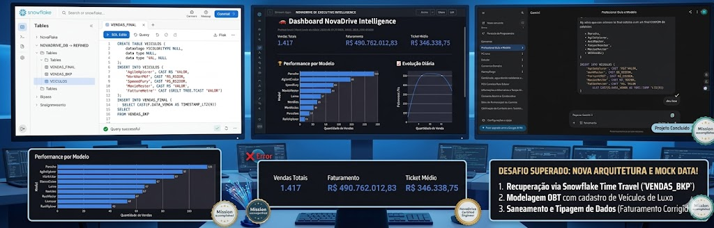
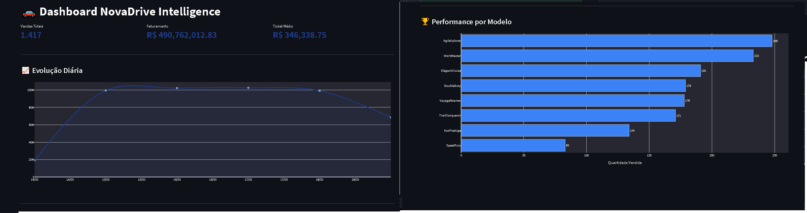

# 🚗 NovaDrive: End-to-End Data Intelligence Pipeline 

Este projeto documenta a construção de um pipeline de dados completo para a **NovaDrive**, uma concessionária de veículos de luxo. A solução abrange desde a orquestração em ambiente de nuvem (Azure) até a entrega de um dashboard executivo de alta performance no Snowflake, utilizando práticas de **Arquitetura de Medalhão** e **DevSecOps**.

## 🏗️ Arquitetura do Sistema

O pipeline foi desenhado seguindo a filosofia de efemeridade e conteinerização, garantindo portabilidade e escalabilidade.

* **Infraestrutura:** Máquina Virtual Ubuntu na **Microsoft Azure**.
* **Orquestração:** **Apache Airflow** rodando via **Docker-Compose**.
* **Data Warehouse:** **Snowflake** (Camadas Bronze/Stage e Gold/Refined).
* **Visualização:** **Streamlit** (Snowpark) para análise de KPIs em tempo real.



---

## 🛠️ Stack Tecnológica

| Categoria | Tecnologia | Uso Principal |
| :--- | :--- | :--- |
| **Cloud** | Azure | Hospedagem da infraestrutura de processamento. |
| **Container** | Docker | Isolamento e portabilidade do ambiente Airflow. |
| **Workflow** | Airflow | Agendamento e monitoramento das DAGs de ETL. |
| **DW** | Snowflake | Armazenamento e modelagem (Arquitetura Medalhão). |
| **Language** | Python | Transformação de dados (Pandas) e interface (Streamlit). |

---

## 🔐 Conectividade e Segurança

Esta pipeline foi desenhada para operar em dois modos de conectividade:

- Produção em nuvem (endereços públicos controlados)
- Execução local via Docker network (containers isolados)

### Origem dos Dados

- Sistema de Vendas (Web): IP 143.244.215.137, porta 3002, usuário funcional vendedor1.
- Banco de Produção (Source): PostgreSQL em 159.223.187.110, database novadrive, usuário etlreadonly.

### Gestão de Segredos com .env

Todas as credenciais e parâmetros sensíveis devem ser externalizados no arquivo .env e nunca versionados no Git.

Variáveis recomendadas para o projeto:

- SOURCE_DB_HOST
- SOURCE_DB_PORT
- SOURCE_DB_NAME
- SOURCE_DB_USER
- SOURCE_DB_PASSWORD
- SALES_APP_HOST
- SALES_APP_PORT
- SALES_APP_USER
- SALES_APP_PASSWORD
- AIRFLOW__CORE__FERNET_KEY
- AIRFLOW_ADMIN_USER
- AIRFLOW_ADMIN_PASSWORD
- DW_TARGET_TYPE
- DW_DB_HOST
- DW_DB_PORT
- DW_DB_NAME
- DW_DB_USER
- DW_DB_PASSWORD

Boas práticas adotadas:

- Não armazenar senha em DAG, SQL ou código Python.
- Não commitar .env, chaves privadas ou credenciais em texto claro.
- Usar perfis distintos para ambiente local e produção.

### Airflow Connections (Admin -> Connections)

Crie conexões separadas por ambiente para evitar acoplamento entre desenvolvimento e produção.

#### Produção (acesso externo por IP)

Connection de origem em produção:

- Connection Id: postgres_prod
- Connection Type: Postgres
- Host: 159.223.187.110
- Schema: novadrive
- Login: etlreadonly
- Password: definida via secret manager ou variável de ambiente
- Port: 5432

Connection para validação funcional do sistema de vendas:

- Armazenar host, porta e usuário da aplicação de vendas em Variables/Secrets do Airflow.
- Referência operacional: 143.244.215.137:3002, usuário vendedor1.

#### Local (acesso interno via Docker network)

Connection de origem local (container de source):

- Connection Id: postgres
- Connection Type: Postgres
- Host: novadrive-source-db
- Schema: novadrive
- Login: novadrive
- Password: definida no .env local
- Port: 5432

Connection de warehouse local em Postgres (opcional):

- Connection Id: warehouse_postgres
- Connection Type: Postgres
- Host: warehouse-db
- Schema: warehouse
- Login: warehouse
- Password: definida no .env local
- Port: 5432

### Validação Manual do Sistema de Vendas

Para validação de transações fora do pipeline, utilize o endpoint /procura do sistema web de vendas.

Fluxo recomendado:

1. Informar o ID de transação no endpoint /procura.
2. Confirmar existência e consistência dos dados retornados.
3. Comparar o resultado com os registros já ingeridos na camada de destino (stage/fact).

Exemplo de endpoint base para operação:

- http://143.244.215.137:3002/procura

Observação: qualquer autenticação adicional (token, sessão ou senha) deve ser injetada por variável de ambiente ou secret backend do Airflow, sem exposição no repositório.

---

## 🛡️ Engineering Journey: Desafios e Soluções

### 1. O "Bug dos Quatrilhões" (Integridade de Dados)
Na carga inicial, o faturamento apresentou valores irreais (escala de petabytes). O diagnóstico revelou que o pipeline estava agregando `IDs` de transação como se fossem valores monetários.
* **Solução:** Implementação de um mapeamento rígido de colunas e saneamento da camada *Stage* via `TRUNCATE` para garantir a re-ingestão limpa dos dados.

### 2. Recuperação de Desastre com Time Travel
Durante a refatoração, a tabela principal de vendas foi sobrescrita acidentalmente. 
* **Solução:** Utilizei o recurso de **Time Travel** do Snowflake para realizar o *rollback* e resgate dos dados brutos:
    ```sql
    CREATE OR REPLACE TABLE NOVADRIVE_DB.REFINED.VENDAS_BKP AS 
    SELECT * FROM NOVADRIVE_DB.REFINED.VENDAS_FINAL AT(OFFSET => -3600);
    ```

### 3. Modelagem OBT (One Big Table) para Performance
Para evitar *JOINs* pesados e latência no dashboard, os dados foram desnormalizados na camada **Refined/Gold**.
* **Impacto:** Criação de uma tabela única unindo dimensões de Veículos, Lojas e Clientes, reduzindo drasticamente o tempo de resposta do Streamlit.

### 4. Saneamento de Tipagem e Fuso Horário
Ajuste fino para compatibilidade de dados entre Snowflake e Pandas:
* Conversão forçada de `TIMESTAMP_TZ` para `TIMESTAMP_LTZ` via SQL para garantir a precisão temporal.
* Tratamento de tipos numéricos para cálculos acurados de **Ticket Médio**.

---

## 📊 Resultados: Dashboard Executivo

O dashboard final entrega uma visão granular com faturamento verificado de **R$ 490 Milhões**.

* **Evolução Diária:** Gráfico com suavização *spline* e área sombreada para identificação de picos de venda.
* **Top Performance:** Ranking dos modelos de luxo (AgileXplorer, SpeedFury, etc.) mais vendidos.



---

## 🚀 Modos de Execução

Este projeto mantém duas versões operacionais: Cloud e Local.

### Comparativo Arquitetural

| Característica | ☁️ Versão Cloud (Azure/Snowflake) | 💻 Versão Local (Docker/High-End PC) |
| :--- | :--- | :--- |
| Latência de Dados | Média (dependente de rede/API) | Mínima (velocidade de NVMe/RAM) |
| Custo Operacional | Variável (créditos Snowflake + Azure) | Zero (uso do hardware próprio) |
| Escalabilidade | Elástica (praticamente infinita) | Limitada (recursos físicos da máquina) |
| Privacidade | Dados em servidores de terceiros | Total (os dados não saem do PC) |
| Finalidade | Produção / Entrega final | Prototipagem / Dev ágil / IA privada |

### Versão Cloud (produção)

Use esta opção para executar com conectividade externa (IP público), mantendo o warehouse em Snowflake.

1. Clone o repositório:
    ```bash
    git clone https://github.com/vdfs89/airflow-bootcamp.git
    ```
2. Crie o arquivo `.env` e preencha variáveis de produção (source, app de vendas e DW).
3. Configure as conexões no Airflow (Admin -> Connections):
    - `postgres_prod` apontando para `159.223.187.110:5432` (db `novadrive`, user `etlreadonly`)
    - conexão do DW em Snowflake (conta, warehouse, database e schema conforme ambiente)
4. Suba a stack:
    ```bash
    docker compose up -d --build
    ```
5. Acesse o Airflow em `http://localhost:8080`.

### Versão Local (Docker Desktop + WSL2)

Use esta opção para operação 100% local com banco source em container e DW local (Postgres ou DuckDB).

1. Copie `.env.example` para `.env`.
2. Ajuste usuário/senha do Airflow e variáveis locais.
3. (Opcional) Gere `FERNET_KEY`:
    ```bash
    python -c "from cryptography.fernet import Fernet; print(Fernet.generate_key().decode())"
    ```
4. Suba a stack local:
    ```bash
    docker compose up -d --build
    ```
5. Para incluir warehouse Postgres local:
    ```bash
    docker compose --profile warehouse-postgres up -d --build
    ```

### Connections no Airflow por ambiente

Cloud (externo):

- Source Postgres: `postgres_prod`
  - Host: `159.223.187.110`
  - Porta: `5432`
  - Database: `novadrive`
  - User: `etlreadonly`

Local (rede Docker):

- Source Postgres: `postgres`
  - Host: `novadrive-source-db`
  - Porta: `5432`
  - Database: `novadrive`
  - User: `novadrive`
- Warehouse Postgres (opcional): `warehouse_postgres`
  - Host: `warehouse-db`
  - Porta: `5432`
  - Database: `warehouse`
  - User: `warehouse`

DuckDB local (opcional):

- Connection Id: `duckdb_local`
- Extra:
  ```json
  {
     "database": "/opt/airflow/data/warehouse.duckdb"
  }
  ```

### Observações operacionais

- Airflow UI: `http://localhost:8080`
- Usuário padrão: `airflow`
- Senha padrão: `airflow`
- No Windows + WSL2, execute comandos na raiz do projeto para garantir bind mounts corretos.
- Evite salvar segredos em DAGs, SQLs ou no repositório.

### Dashboard Executivo Local (Streamlit)

1. Instale as dependências:
  ```bash
  pip install -r requirements.txt
  ```
  Este arquivo na raiz contém apenas dependências do dashboard Streamlit.
  As dependências do Airflow ficam em `requirements-airflow.txt` e são
  instaladas no build do container.
2. Garanta que o arquivo DuckDB exista (padrão): `data/warehouse.duckdb`.
3. (Opcional) Configure variáveis para customizar o app:
  - `NOVADRIVE_DUCKDB_PATH`
  - `SALES_API_BASE_URL`
  - `SALES_API_TIMEOUT`
4. Execute o dashboard:
  ```bash
  streamlit run streamlit/app.py
  ```

#### Segredos no Streamlit: preciso criar?

Para execução local, não é obrigatório criar st.secrets se você já usa .env.

- Recomendado no local: .env como fonte única de variáveis.
- Recomendado em deploy gerenciado do Streamlit: st.secrets.

O app foi preparado para ler na seguinte ordem:

1. st.secrets (quando existir)
2. Variáveis de ambiente carregadas do .env

Exemplo de `.streamlit/secrets.toml`:

```toml
[postgres]
host = "159.223.187.110"
database = "novadrive"
user = "etlreadonly"
password = "<defina_no_secret_manager>"
port = 5432

[sales_api]
password = "<defina_no_secret_manager>"
```

Exemplo de variáveis para o dashboard:

- NOVADRIVE_DUCKDB_PATH
- SALES_API_BASE_URL
- SALES_API_TIMEOUT

---

> **Nota sobre DevSecOps:** Este projeto utiliza práticas de segurança rigorosas, incluindo o uso de `.gitignore` para impedir o vazamento de segredos e permissões NTFS (`icacls`) para proteção de chaves privadas em ambiente Windows/WSL.
